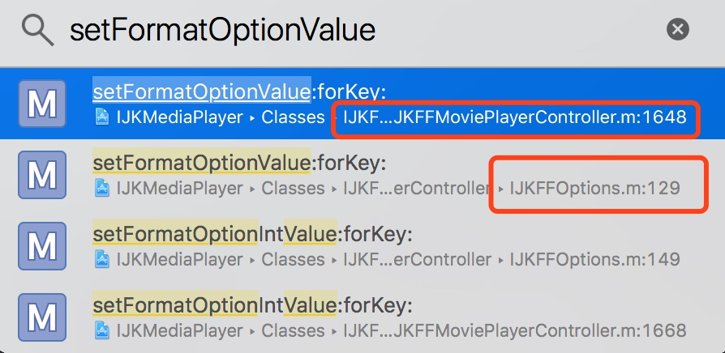

# IJK flv截流问题解决过程
### 背景
> 为了适应库中的各种资源，接入IJKPlayer利用软解播放flv，但是针对给定的流地址，播放器返回459的错误码，并播放失败。

### 针对459错误码的调研
> ”459”; Aggregate operation not allowed
> ”459”; 不允许聚合操作

### 排查可能影响设置UA header等信息的地方
初始化IJKFFPlayer时需要一个IJKFFOptions对象，这个对象默认值方法如下：
    
```
+ (IJKFFOptions *)optionsByDefault
{
    IJKFFOptions *options = [[IJKFFOptions alloc] init];

    [options setPlayerOptionIntValue:30     forKey:@"max-fps"];
    [options setPlayerOptionIntValue:0      forKey:@"framedrop"];
    [options setPlayerOptionIntValue:3      forKey:@"video-pictq-size"];
    [options setPlayerOptionIntValue:0      forKey:@"videotoolbox"];
    [options setPlayerOptionIntValue:960    forKey:@"videotoolbox-max-frame-width"];

    [options setFormatOptionIntValue:0                  forKey:@"auto_convert"];
    [options setFormatOptionIntValue:1                  forKey:@"reconnect"];
    [options setFormatOptionIntValue:30 * 1000 * 1000   forKey:@"timeout"];
    [options setFormatOptionValue:@"ijkplayer"          forKey:@"user-agent"];

    options.showHudView   = NO;

    return options;
}
```
找到了user-agent的设置，与我的实现代码想对比发现除了对player进行设置UA外，对option也可以设置UA，



```
- (void)setFormatOptionValue:       (NSString *)value forKey:(NSString *)key;
```
`然而这并不是问题的关键，这两个值设置都是起效的`
### 回归请求本身
抓包，通过Charles抓包没有抓到播放器播放请求的HTTP请求包（目前还没有发现原因），换成WireShark来抓包抓取到了播放器发出的HTTP请求包，发现除了UA外，需求中还需要设置Refer字段，通过以下方式设置并未生效：

```
[option setFormatOptionValue:@"xxxxxx" forKey:@"Referer"];
```
### 对于Refer的设置问题
至此，问题已经确定为对Refer的设置未生效引起的播放错误，

关于header的设置参见：[FFMpeg protocols](https://www.ffmpeg.org/ffmpeg-protocols.html#http)

> Set custom HTTP headers, can override built in default headers. The value must be a string encoding the headers.

所以最后解决方法在Github上找到了：[请问下iOS下能否设置自定义请求头](https://github.com/Bilibili/ijkplayer/issues/2415)

```
[options setFormatOptionValue:@"Referer:http://github.com\r\nRange:byte=1-1000" forKey:@"headers"];
```

### 结论：
Refer不能单独设置，只能写在header中，以一个整体设置;如果存在多个key值的header，需要以为key1:value1\r\nkey2:value2的形式来表示，作为header的值来设给header
### 思考：
- 那为什么UA可以单独设置？而Header却不可以
- 为什么Charles没能抓到播放器播放时发出的HTTP流地址请求，但WireShark却可以


